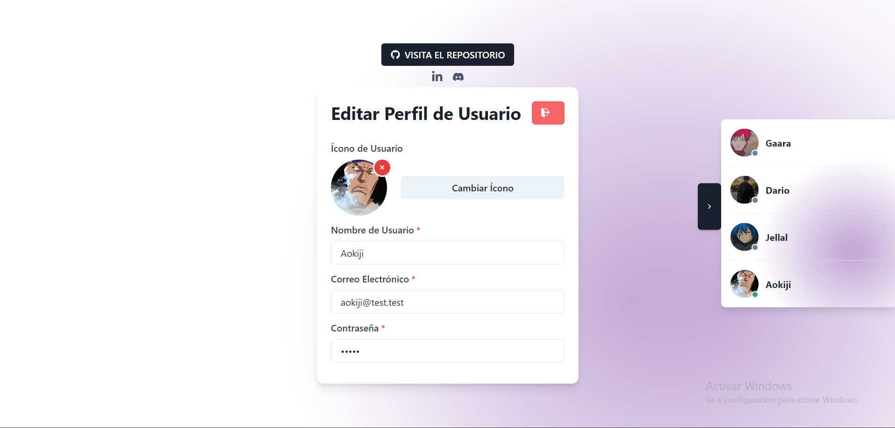
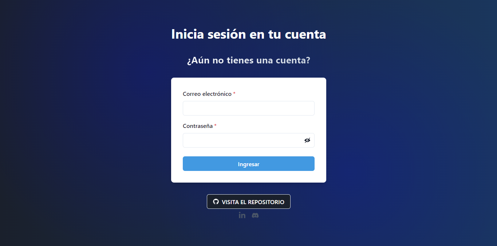
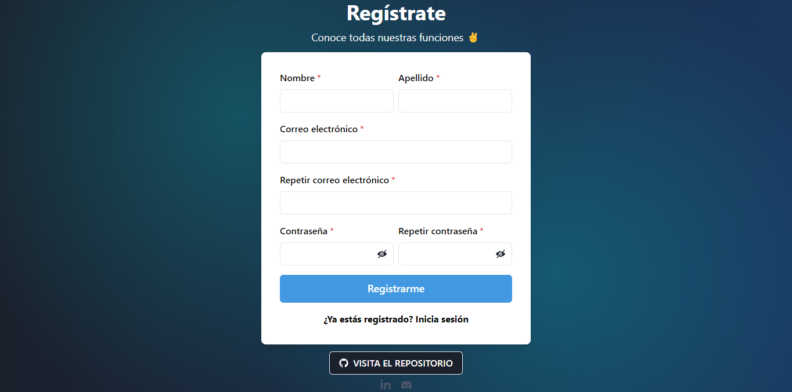

# SimpleAuth 🔒 

[Español](README.md)  / [Inglés](README_en.md) 

## 📖 Sobre el proyecto

SimpleAuth es un proyecto utilizando el manejo de autentificación y sesiones, permitiendo el registro, ingreso y sesiones activas y seguras utilizando JWT. También permitiendo la opción de cambiar la imagen de perfil, contraseña (cifrada con hash MD5), visualización en tiempo real de usuarios conectados/desconectados y próximamente recuperación de contraseña y verificación de cuenta mediante correo electrónico.

## 💻 Tecnologías usadas

- **Frontend:** React.js, Chakra-UI
- **Backend:** Node.js, Express
- **Autentificación:** JWT
- **Base de datos:** MongoDB

## 🚀 ¿Cómo deployarlo?

- `git clone https://github.com/DarioAlbor/SimpleAuth.git`

## Frontend
- `cd client`
- `cd src/utils/apiroutes.js` Modificar la ruta con tu backend
- `yarn`
- `yarn start`
## Backend
- `cd server`
- Modificar `.env.example` con tus datos y renombrarlo a `.env`
- `npm install`
- `npm run dev`

## 📬 Contacto

Puedes contactarme mediante mi [LinkedIn](https://www.linkedin.com/in/albordario/).

## 📷 Imágenes

|  |  |
|:---------------------------------------------:|:------------------------------------------:|
| Perfil del usuario                            | Inicio de sesión                           |
|                                               |                                            |
|          |  |
| Registro                                      | Cambiar imagen de perfil                   |