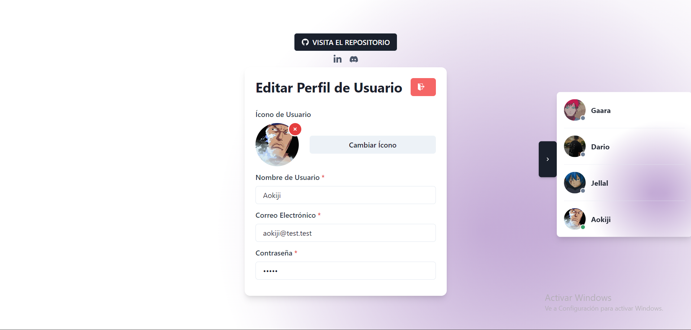
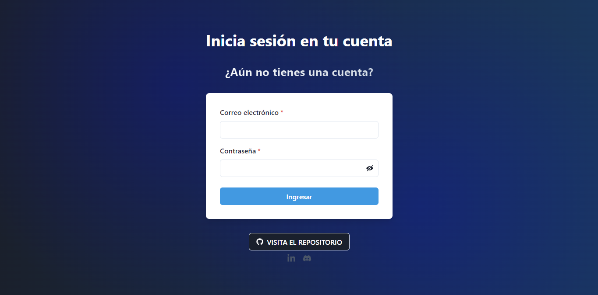
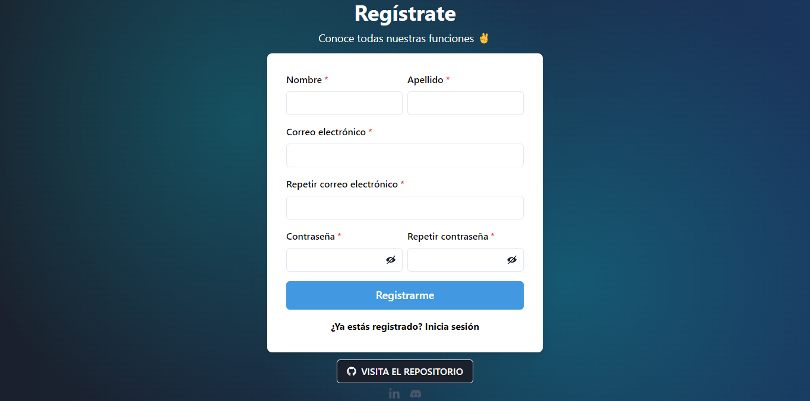
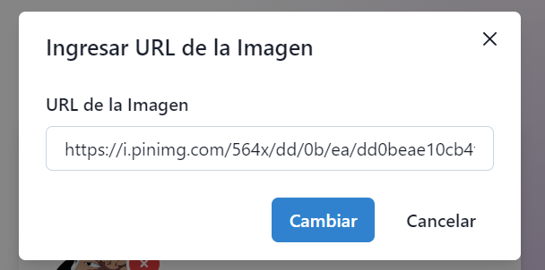

# SimpleAuth 🔒

[Spanish](README.md)  / [English](README_en.md) 

## 📖 About the project

SimpleAuth is a project using authentication and session management, allowing for secure registration, login, and active sessions using JWT. It also allows for changing profile pictures, changing passwords (hashed with MD5), real-time viewing of connected/disconnected users, and soon password recovery and account verification via email.

## 💻 Technologies used

- **Frontend:** React.js, Chakra-UI
- **Backend:** Node.js, Express
- **Authentication:** JWT
- **Database:** MongoDB

## 🚀 How to deploy

- `git clone https://github.com/DarioAlbor/SimpleAuth.git`

## Frontend
- `cd client`
- `cd src/utils/apiroutes.js` Modify the route with your backend
- `yarn`
- `yarn start`
## Backend
- `cd server`
- Modify `.env.example` with your data and rename it to `.env`
- `npm install`
- `npm run dev`

## 📬 Contact

You can contact me via my [LinkedIn](https://www.linkedin.com/in/albordario/).

## 📷 Images

|  |  |
|:---------------------------------------:|:-------------------------------:|
| User Profile                            | Login                           |
|                                         |                                |
|    |  |
| Register                                | Change Profile Image            |